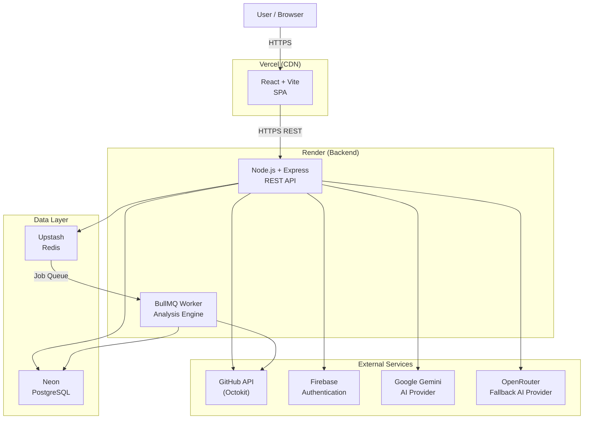
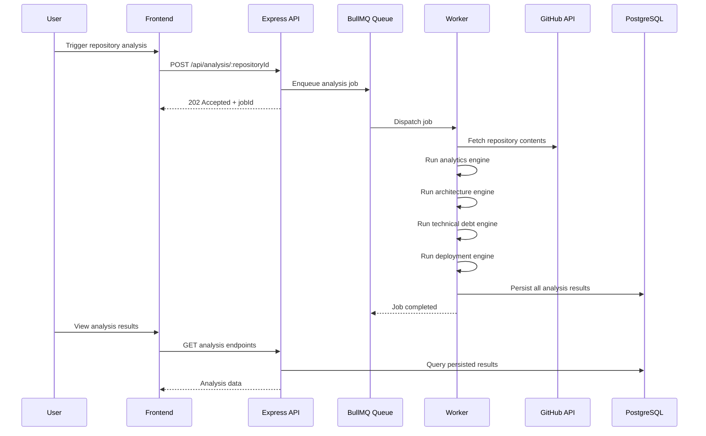

# DevLens

DevLens is an AI-powered Engineering Intelligence Platform that analyzes GitHub repositories and surfaces engineering insights across repository health, architecture, technical debt, deployment readiness, pull request risk, and overall engineering quality. It is built for engineers and engineering teams who want a structured, data-driven view of a codebase without manually auditing it.

DevLens connects to your GitHub account, synchronizes your repositories, and runs a suite of analysis engines — producing scored reports, dependency graphs, risk breakdowns, and AI-generated engineering reviews backed by the actual analysis data.

---

## Features

### Repository Analytics

When a repository is synchronized and analyzed, DevLens collects and stores the following metadata via the GitHub API:

- Stars, forks, watchers, and open issues
- Primary language and full language breakdown
- Contributor count
- Last commit date
- Default branch
- Repository visibility (public / private)
- Technology detection from `package.json` dependency manifests

All analytics are persisted and displayed on the repository overview and dashboard.

### Architecture Intelligence

DevLens performs static dependency analysis on the repository's source files to produce a module-level dependency graph. The analysis includes:

- **Dependency graph construction** — nodes represent source files/modules, edges represent import/require relationships
- **Graph metrics** — node count, edge count, and a complexity score derived from graph structure
- **Circular dependency detection** — identifies whether circular import chains exist in the codebase
- **Architecture analytics** — aggregated metrics calculated from the graph
- **Architecture insights and recommendations** — generated from metrics and graph characteristics
- **Interactive dependency graph visualization** — rendered in the frontend using React Flow with ELK.js and Dagre layout engines

### Technical Debt Intelligence

The technical debt analyzer scans the repository's source tree and produces a scored report covering:

- **Technical debt score** and **maintainability score** (0–100)
- **Large file detection** — files exceeding size thresholds that may indicate poor separation of concerns
- **Dead file detection** — source files with no detected inbound dependencies
- **Circular dependency count** — number of circular dependency chains found
- **Deep dependency chain count** — module chains that exceed a complexity depth threshold
- **Recommendations** — specific, evidence-based suggestions for reducing debt

All findings are stored per repository and displayed with file-level detail in the Technical Debt workspace.

### Deployment Intelligence

The deployment analyzer fetches the repository's root-level file tree and evaluates deployment readiness across five dimensions, each producing an individual score:

| Dimension | What is checked |
|---|---|
| **Infrastructure** | Dockerfile presence, Docker Compose presence |
| **Configuration** | `.env.example` / `.env.sample` presence, README with setup instructions |
| **Build Readiness** | `package.json` scripts (`build`, `start`, `dev`), frontend/backend project detection |
| **CI/CD** | GitHub Actions workflow directory, build/test/deploy workflow detection, lint workflow detection, workflow quality analysis |
| **Docker Quality** | Multi-stage builds, `WORKDIR`, `EXPOSE`, `CMD`/`ENTRYPOINT` instructions |

Additional checks include lock file detection (`package-lock.json`, `yarn.lock`, `pnpm-lock.yaml`, `bun.lockb`), runtime version pinning (`.nvmrc`, `.node-version`), and deployment platform detection (Vercel, Netlify, Render, Railway, Fly.io, Docker Compose).

The overall deployment score is a weighted composite of all dimensions. The final status is one of: `Production Ready`, `Deployable`, `Deployable With Risks`, or `Not Deployment Ready`.

### Pull Request Risk Analysis

DevLens fetches open pull requests for a repository via the GitHub API and performs risk assessment on any PR on demand. The analysis includes:

- **File classification** — changed files are categorized into: critical application code, dependency files, infrastructure files, documentation files, and other
- **Risk score** (0–100) and **risk level** (`Low`, `Medium`, `High`, `Critical`) based on a weighted scoring model
- **Risk breakdown** — individual contributions from critical file changes, infrastructure changes, dependency changes, and total file count
- **Dependency change detection** — flags PRs that modify dependency manifests
- **Configuration change detection** — flags PRs that modify infrastructure or configuration files
- **Critical file list** — enumerates the specific high-risk files modified
- **Recommendations** — contextual guidance based on what changed (e.g., staging validation for infrastructure changes, security checks for dependency bumps, regression testing for high-risk PRs)

Technology-aware dependency file classification is supported — the risk engine uses the repository's detected tech stack to identify the relevant dependency file patterns.

### Engineering Health

The Engineering Health workspace aggregates scores from all analysis dimensions into a single composite engineering score. The weighting is:

| Dimension | Weight |
|---|---|
| Repository Health | 30% |
| Technical Debt | 25% |
| Architecture | 20% |
| Deployment | 15% |
| Pull Request Risk | 10% |

The architecture contribution is normalized from the raw complexity score and circular dependency flag. The pull request contribution inverts the PR risk score (`100 - riskScore`).

The composite score maps to a status label: `Excellent` (≥90), `Healthy` (≥80), `Good` (≥70), `Needs Attention` (≥60), or `Critical` (<60).

The workspace also surfaces aggregated strengths and up to five priority recommendations drawn from across all analysis dimensions.

### AI Repository Review

The AI review generates a structured engineering assessment by synthesizing all available analysis data — repository health, architecture, technical debt, deployment readiness, and pull request risk. The AI is not given raw source code; it receives only the structured analysis output produced by DevLens.

The review is produced using a primary/fallback AI orchestration layer:

- **Primary provider**: Google Gemini (`gemini-2.5-flash`)
- **Fallback providers**: OpenRouter (configurable models, defaulting to `qwen/qwen-2.5-coder-32b-instruct` and `meta-llama/llama-3.3-70b-instruct`)

The review output includes:

- **Executive Summary** — engineering maturity assessment and a leadership-level summary of risks and next steps
- **Engineering Score** — numeric scores (0–100) for overall quality, maintainability, security, architecture, testing, documentation, and scalability
- **Strengths** — 3–6 identified engineering strengths supported by the analysis data
- **Critical Issues** — 3–6 prioritized issues with severity (`High`, `Medium`, `Low`) and explanation
- **Action Plan** — 3–6 phased engineering tasks (`Immediate`, `Short-term`, `Long-term`) with effort estimates and justification
- **Technology Insights** — per-technology observations for technologies detected in the repository
- **Architecture Suggestions** — 2–5 specific architecture improvements with priority and expected engineering benefits

Reviews are persisted and can be refreshed on demand.

### Background Analysis

When Redis is available, triggering a full repository analysis (analytics + architecture + technical debt + deployment) enqueues a BullMQ job rather than running synchronously. The worker process picks up the job and runs all four analysis engines sequentially.

Queue configuration:

- 3 automatic retry attempts with exponential backoff (starting at 5 seconds)
- Worker concurrency of 3 simultaneous jobs
- Graceful shutdown on `SIGTERM` / `SIGINT`
- Completed and failed job retention limits

In development without Redis, analysis runs inline on the same request. In production, this decouples expensive analysis work from the HTTP request cycle and allows the backend and worker to scale independently.

---

## Architecture

### Production Deployment



### Analysis Flow



---

## Tech Stack

### Frontend

| Technology | Purpose |
|---|---|
| React 19 | UI framework |
| Vite | Build tool and dev server |
| React Router v7 | Client-side routing |
| Tailwind CSS v4 | Utility-first styling |
| Axios | HTTP client |
| React Flow / @xyflow/react | Dependency graph visualization |
| ELK.js | Graph layout engine |
| Dagre | Graph layout engine (alternative) |
| Lucide React | Icon library |
| Framer Motion | Animations |
| Firebase | GitHub OAuth authentication |
| react-hot-toast | Toast notifications |

### Backend

| Technology | Purpose |
|---|---|
| Node.js | Runtime |
| Express v5 | HTTP framework |
| Prisma | ORM and database client |
| PostgreSQL | Primary database |
| Zod | Environment and request validation |
| Winston | Structured logging |
| Helmet | Secure HTTP headers |
| express-rate-limit | Rate limiting |
| CORS | Cross-origin request handling |
| Compression | Response compression |
| jsonwebtoken | JWT issuance and verification |
| BullMQ | Job queue for background analysis |
| ioredis | Redis client |
| Octokit (@octokit/rest) | GitHub API client |
| @google/genai | Google Gemini AI provider |
| Axios | OpenRouter AI provider (HTTP) |
| firebase-admin | Firebase token verification |
| bcryptjs | Password hashing |

### Infrastructure

| Technology | Purpose |
|---|---|
| Docker | Container runtime |
| Docker Compose | Local multi-service orchestration |
| Vercel | Frontend hosting and CDN |
| Render | Backend API and worker hosting |
| Neon | Serverless PostgreSQL |
| Upstash | Serverless Redis |

---

## Security

DevLens implements security controls at multiple layers:

**Authentication and authorization**
- GitHub OAuth via Firebase on the frontend; Firebase ID tokens are exchanged for application JWTs
- All protected API routes require a valid `Bearer` JWT verified against `JWT_SECRET`
- Repository ownership is checked on every request — users can only access their own repositories

**Input validation**
- Zod validates all environment variables at startup; the process exits immediately if any required variable is missing or malformed
- Request parameters are validated with Zod schemas via a centralized validation middleware before reaching controllers

**Rate limiting**
- General API endpoints: 300 requests per 15 minutes
- Authentication endpoints: 10 requests per 15 minutes
- AI and heavy analysis endpoints: 30 requests per 15 minutes

**HTTP security**
- `helmet` sets secure HTTP response headers
- CORS is restricted to the configured `CLIENT_URL` origin
- `x-powered-by` is disabled
- Response compression is applied via `compression`

**Infrastructure**
- Server Docker container runs as a non-root `node` user
- Prisma migrations are applied at container startup before the server process starts

**Logging and error handling**
- Winston provides structured logging; production logging does not echo raw request bodies or credential values
- A centralized error handler normalizes all errors into a consistent API response format

**AI safety**
- The AI review prompt explicitly instructs the model not to invent data and to base all conclusions on the supplied structured analysis only
- AI provider responses are parsed as structured JSON; invalid responses are rejected

---

## Local Development

### Prerequisites

- Node.js 22+
- Docker and Docker Compose (for local PostgreSQL and Redis)
- A GitHub account and OAuth app (for Firebase authentication)
- A Google Gemini API key

### Using Docker Compose (recommended)

The `docker-compose.yml` at the repository root starts PostgreSQL and Redis locally, along with the backend API, worker, and frontend.

```bash
docker compose up
```

Services:

| Service | Port |
|---|---|
| Frontend | 5173 |
| Backend API | 5000 |
| PostgreSQL | 5432 |
| Redis | 6379 |

### Manual Setup

**Backend**

```bash
cd server
cp .env.example .env
# Fill in all required variables in .env
npm install
npx prisma migrate dev
npm run dev
```

**Worker** (separate terminal)

```bash
cd server
npm run worker
```

**Frontend**

```bash
cd client
npm install
npm run dev
```

### Environment Variables

**Server** (`server/.env`)

| Variable | Description |
|---|---|
| `NODE_ENV` | `development`, `test`, or `production` |
| `PORT` | HTTP server port (e.g. `5000`) |
| `DATABASE_URL` | PostgreSQL connection string |
| `JWT_SECRET` | JWT signing secret (minimum 32 characters) |
| `GEMINI_API_KEY` | Google Gemini API key |
| `GEMINI_MODEL` | Gemini model name (default: `gemini-2.5-flash`) |
| `OPENROUTER_API_KEY` | OpenRouter API key (optional fallback) |
| `OPENROUTER_BASE_URL` | OpenRouter base URL |
| `OPENROUTER_MODEL_PRIMARY` | Primary OpenRouter model |
| `OPENROUTER_MODEL_SECONDARY` | Secondary OpenRouter model |
| `CLIENT_URL` | Frontend origin URL for CORS |
| `REDIS_URL` | Redis connection URL |

**Frontend** (`client/.env`)

| Variable | Description |
|---|---|
| `VITE_API_URL` | Backend API base URL (e.g. `http://localhost:5000/api`) |
| `VITE_FIREBASE_API_KEY` | Firebase project API key |
| `VITE_FIREBASE_AUTH_DOMAIN` | Firebase auth domain |
| `VITE_FIREBASE_PROJECT_ID` | Firebase project ID |
| `VITE_FIREBASE_STORAGE_BUCKET` | Firebase storage bucket |
| `VITE_FIREBASE_MESSAGING_SENDER_ID` | Firebase messaging sender ID |
| `VITE_FIREBASE_APP_ID` | Firebase app ID |

---

## License

[MIT](./LICENSE) — Copyright (c) 2026 DevLens
